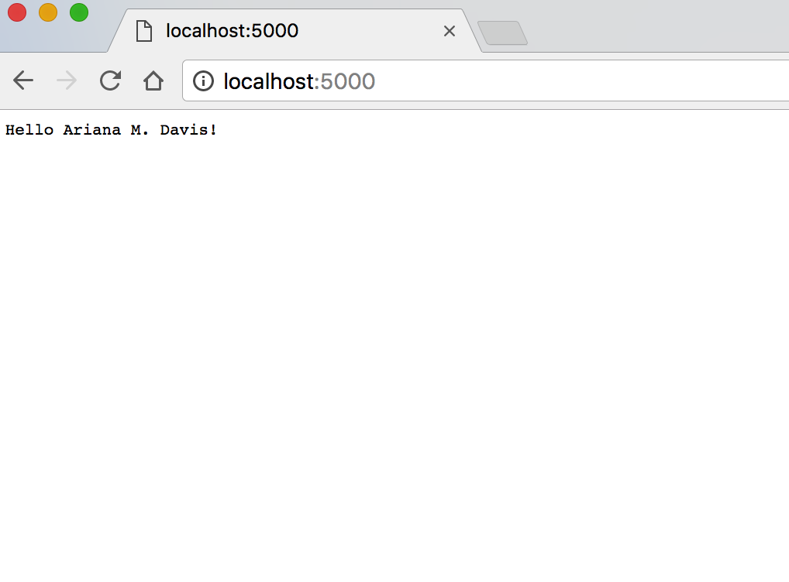
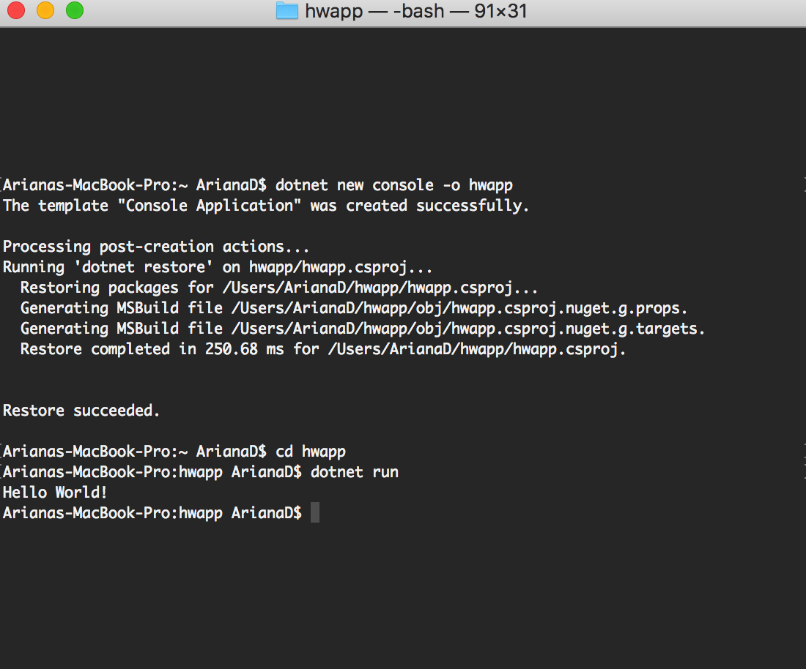

> **NOTE:** This README.md file should be placed at the **root of each of your repos directories.**
>
>Also, this file **must** use Markdown syntax, and provide project documentation as per below--otherwise, points **will** be deducted.
>

# LIS4369 - Extensible Enterprise Solutions

## Ariana M. Davis 

### LIS4369 Requirements:

*Four Parts:*

1. Distributed Version Control with Git and Bitbucket
2. Development Installations
3. Chapter Questions 
4. Bitbucket repo links: a) this assignment and b) the completed tutorials above (bitbucketstationlocations and myteamquotes).

#### README.md file should include the following items:

* Screenshot of hwapp application running
* Screenshot of aspnetcoreapp appkication running My.Net Core Installation; 
* git commands w/short descriptions;

> #### Git commands w/short descriptions:

1. git init - creates an empty Git repository - basically a git directory
2. git status - displays paths that have differences between the index file and the current HEAD commit
3. git add - updates the index using the current content found in the working tree 
4. git commit - records changes to the repository
5. git push - update remote refs along with associated objects 
6. git pull - fetch from and intergrate with another repository or a local branch
7. git merge - join two or more development histories together

#### Assignment Screenshots:

*Screenshot of aspnetcoreapp running [My .NET Core Installation](http://localhost:5000 ".NET Core Localhost")*:

*Screenshot of hwapp application running*:

#### Tutorial Links:

*Bitbucket Tutorial - Station Locations:*
[A1 Bitbucket Station Locations Tutorial Link](https://bitbucket.org/yourmobilegeek/bitbucketstationlocations "Bitbucket Station Locations")

*Tutorial: Request to update a teammate's repository:*
[A1 My Team Quotes Tutorial Link](https://bitbucket.org/yourmobilegeek/myteamquotes "My Team Quotes Tutorial")
