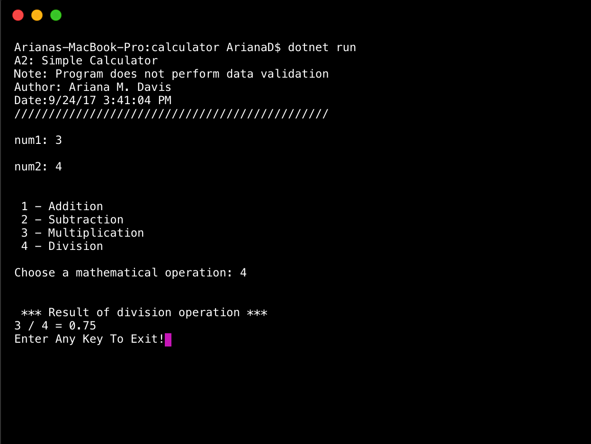

> **NOTE:** This README.md file should be placed at the **root of each of your repos directories.**
>
>Also, this file **must** use Markdown syntax, and provide project documentation as per below--otherwise, points **will** be deducted.
>

# LIS4369 - Extensible Enterprise Solutions

## Ariana M. Davis 

### LIS4369 Requirements:

*Three Parts:*

1. Create Calculator Application
2. Display Date and Time 
3. Verify that you can't divide by zero 

#### README.md file should include the following items:

* Screenshot of valid operation
* Screenshot of invalid operation 
* Screenshot of not being able to divide by zero ( extra credit )

#### Assignment Screenshots:

*Screenshot of valid operation application running*:

*Screenshot of invalid operation application running*:

*Screenshot of extra credit*:

