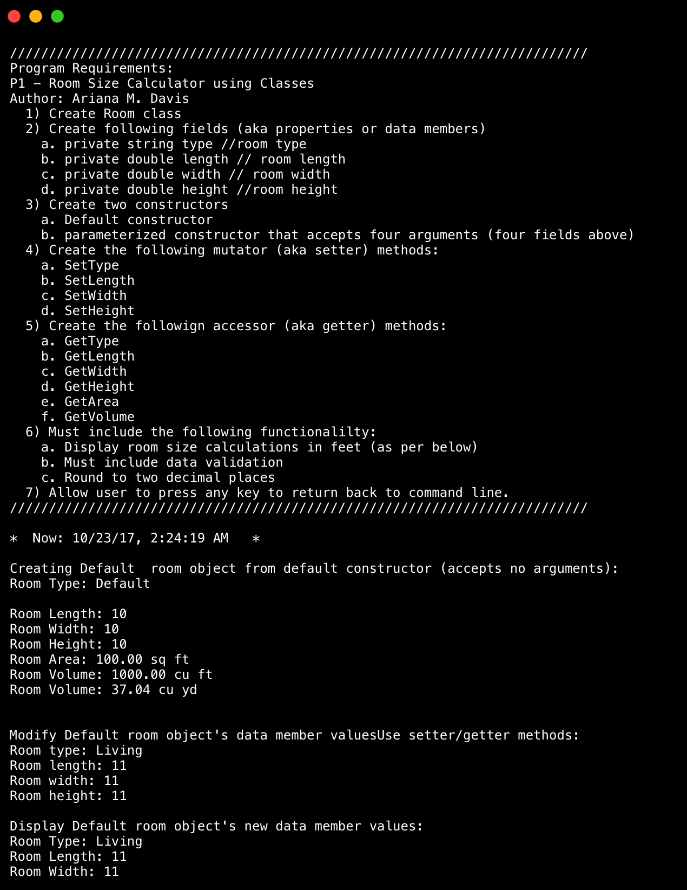
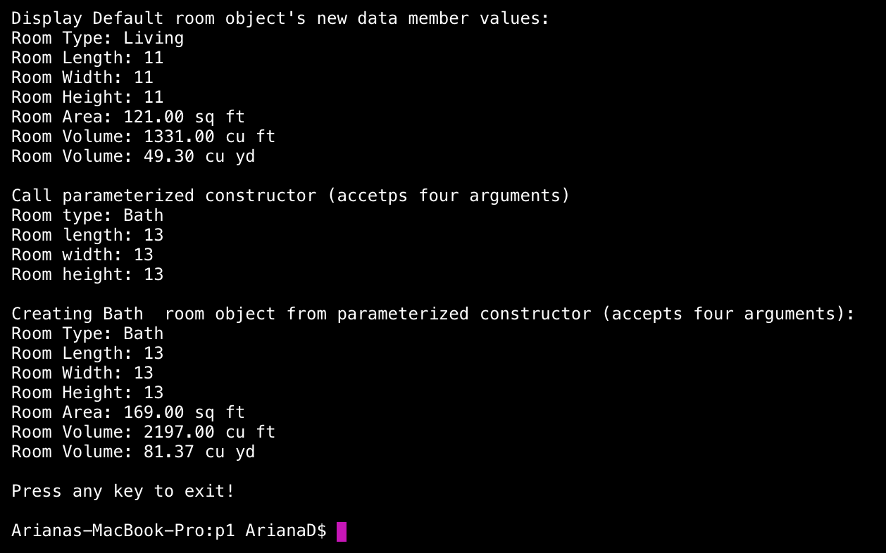

> **NOTE:** This README.md file should be placed at the **root of each of your repos directories.**
>
>Also, this file **must** use Markdown syntax, and provide project documentation as per below--otherwise, points **will** be deducted.
>

# LIS4369 - Extensible Enterprise Solutions

## Ariana M. Davis 

### LIS4369 Requirements:

*Five Parts:*

1. Backward-engineer (using .NET Core) the console application screenshot:
2. Display short assignment requirements Display your name as “author”
3. Display current date/time (must include date/time, your format preference)
4. Must perform and display room size calculations, must include data validation and rounding to two decimal places.
5. Each data member must have get/set methods, also GetArea and GetVolume

#### README.md file should include the following items:

* Screenshot of room calculator application

#### Assignment Screenshots:

*Screenshot of calculator application*:

